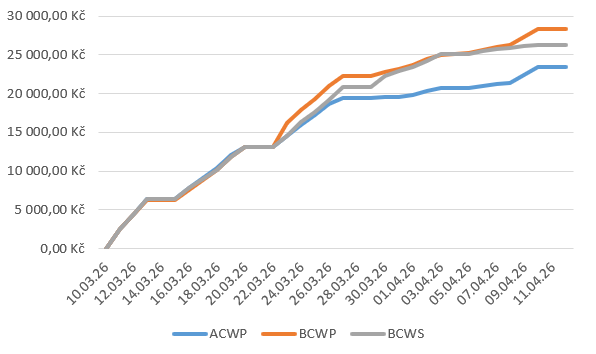
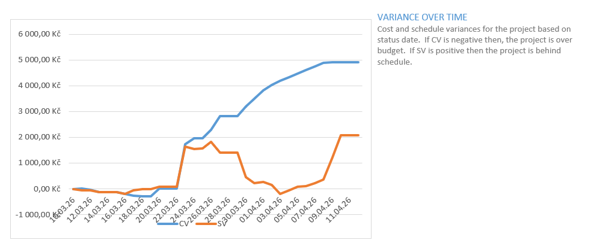
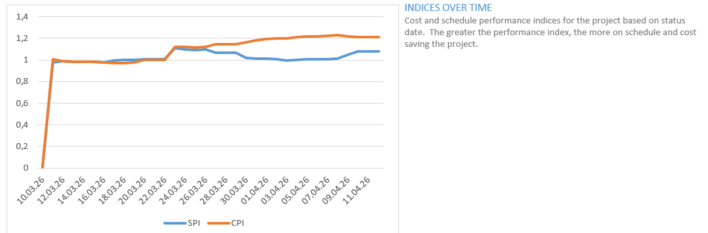

# MPR 2. úkol – odhad ceny výsledného produktu

**Autor:** Tomáš Hlásenský (xhlase01)  
**Datum:** 12. 4. 2026  
**Tým:** 404 Team Name Not Found

---

## 1 Použitá metoda

Pro odhad ceny projektu byla zvolena metoda **Earned Value Management (EVM)**. Tato metoda umožňuje průběžně sledovat výkonnost projektu porovnáváním skutečně vynaložených nákladů s hodnotou dosud odvedené práce a s původním plánem.

Sledované ukazatele:

- **ACWP** (Actual Cost of Work Performed) – skutečné náklady na odvedenou práci
- **BCWP** (Budgeted Cost of Work Performed) – plánované náklady na odvedenou práci (dosažená hodnota)
- **BCWS** (Budgeted Cost of Work Scheduled) – plánované náklady k danému datu
- **EAC** (Estimate At Completion) – odhadované celkové náklady při dokončení

Podkladem pro výpočet je plán projektu v MS Project, kde jsou ke každé činnosti přiřazeny konkrétní zdroje a jejich role. Hodinové sazby vycházejí z ceníku uvedeného v tabulce 1 a jsou přímo použity při výpočtu nákladů jednotlivých úkolů.

**Tab. 1: Hodinové sazby dle typu činnosti**

| Typ činnosti             | Sazba (Kč/hod) |
|--------------------------|----------------|
| analýza, specifikace     | 300            |
| plánování, návrh         | 200            |
| implementace, vývoj      | 350            |
| testování, dokumentování | 250            |
| řízení                   | 400            |
| ostatní práce            | 150            |

---

## 2 Výsledky analýzy

Odhad byl proveden k **12. 4. 2026**, tedy ve fázi průběhu projektu. Do projektového plánu byly zaneseny aktuální stavy úkolů a skutečně strávený čas, z čehož byl odvozen ACWP. Klíčové hodnoty EVM jsou shrnuty v tabulce 2.

 
 
 

**Tab. 2: Hodnoty EVM k 12. 4. 2026**

| Ukazatel | Hodnota       |
|----------|---------------|
| EAC      | 43 209,65 Kč  |
| ACWP     | 23 480,00 Kč  |
| BCWP     | 28 392,50 Kč  |

Na základě těchto hodnot lze vypočítat indexy výkonnosti:

| Ukazatel | Výpočet | Výsledek | Interpretace |
|----------|---------|----------|--------------|
| **CPI** | BCWP / ACWP = 28 392,50 / 23 480,00 | **1,21** | Projekt je efektivnější než plán – za každou utracenu korunu vzniká hodnota 1,21 Kč |
| **CV**  | BCWP − ACWP = 28 392,50 − 23 480,00 | **+4 912,50 Kč** | Úspora oproti plánovaným nákladům |
| **SPI** | BCWP / BCWS | **≈ 1,1** | Projekt mírně předbíhá časový plán |

---

## 3 Grafická analýza

**Obr. 1 – Vývoj nákladů v čase (ACWP, BCWP, BCWS)**

ACWP se po celou dobu drží pod hodnotou BCWS, což potvrzuje, že projekt čerpá méně prostředků, než bylo plánováno. BCWP kopíruje nebo přesahuje BCWS, tedy tým odvádí práci v souladu s harmonogramem nebo jej mírně předbíhá.

---

 

**Obr. 2 – Odchylky od plánu (CV a SV)**

CV (Cost Variance) roste v kladných hodnotách – náklady jsou nižší než hodnota odvedené práce, projekt je tedy pod rozpočtem. SV (Schedule Variance) se pohybuje kolem nuly s přechodným vrcholem v březnu, který odpovídá intenzivnější fázi vývoje.

---

**Obr. 3 – Indexy výkonnosti (CPI a SPI)**

CPI se ustálil nad hodnotou 1,2 a nadále roste, což ukazuje na konzistentní úsporu nákladů. SPI se pohybuje stabilně na hodnotě přibližně 1,1, tedy projekt postupuje mírně rychleji, než bylo naplánováno.

---

*Tomáš Hlásenský (xhlase01), tým 404 TNNF*
