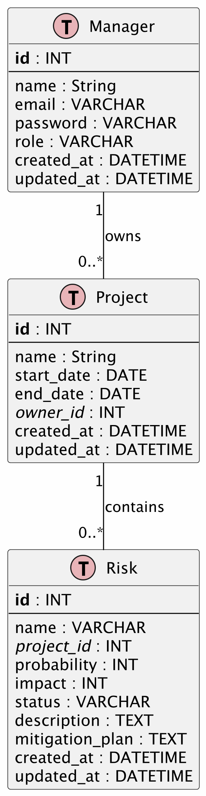

Fakulta informačních technologií
Ústav informačních systémů

Management projektů

## Systém pro podporu řízení rizik v projektech
# SPECIFIKACE POŽADAVKŮ NA SOFTWARE

# 404 TNNF
 
**Datum:** 1.4.2026  


**Autor** Marcel Mravec; Dev, Adm 


## Obsah

1. [Úvod](#1-úvod)
2. [Všeobecný popis](#2-všeobecný-popis)
3. [Specifikace požadavků](#3-specifikace-požadavků)
4. [Ověřovací kritéria](#4-ověřovací-kritéria)
5. [Přílohy](#5-přílohy)


## 1. Úvod

### 1.1 Účel systému

Cílovými uživateli systému budou projektoví manažeři, jejich manažeři, CEOs. Systém má ulehčovat manažerům práci s riziky v rámci projektů.

### 1.2 Rozsah systému

#### 1.2.1 Co systém bude dělat

- správa projektů
- správa manažerů
- identifikaci rizik
- kvalitativní analýzu rizik
- vytvoření registru rizik
- vytvoření matice rizik
- různé přehledy o rizicích, možnosti filtrů
- sledování zadaného počtu nejrizikovějších položek po určité (zadané) období

#### 1.2.2 Co systém nebude dělat (mimo rozsah)

- Helpdesk
- AI doplňování rizik

#### 1.2.3 Hlavní přínosy

| Přínos       | Popis                                                                                          |
| ------------ | ---------------------------------------------------------------------------------------------- |
| Přehled      | Manažeři pro každý svůj projekt jasně uvidí rizikové oblasti                                   |
| Jednoduchost | Systém zkrátí čas zápisu rizika na maximálně 2 minuty. Povinná pole zabrání neúplným záznamům. |

### 1.3 Definice, zkratky a akronymy

| Zkratka     | Význam                              |
| ----------- | ----------------------------------- |
| DSP         | Dokument specifikace požadavků      |
| SRS         | Software Requirements Specification |
| Laravel | Php full-stack framework |

### 1.4 Reference

| #   | Dokument            | Odkaz                              |
| --- | ------------------- | ---------------------------------- |
| 1   | IEEE 830-1984       | Standard pro specifikaci požadavků |

### 1.5 Přehled dokumentu

Tento dokument popisuje požadavky na systém pro podporu řízení rizik v projektech. Struktura dokumentu následuje IEEE 830-1984: sekce 1 definuje účel a rozsah systému, sekce 2 popisuje všeobecný kontext včetně datového modelu, sekce 3 obsahuje detailní specifikaci všech funkcí (CRUD projektů, evidence rizik, autentizace, správa manažerů) spolu s datovým modelem a vnějšími rozhraními, a sekce 4 definuje ověřovací kritéria a testovací postupy.


## 2. Všeobecný popis

### 2.1 Kontext produktu

Systém bude pracovat nezávisle na jiných systémech bude dostupný skrze webový prohlížeč na mpr.marlin-studio.com

#### 2.1.1 Systémové prostředí

- **Operační systém:** Jakkýkoli co má prohlížeč
- **Hardwarové požadavky:** mít hardware
- **Síťové požadavky:** Jakkékoli připojení k internetu

#### 2.1.2 Vazby na externí systémy

| Externí systém | Rozhraní | Účel             |
| -------------- | -------- | ---------------- |
| SQLite         | DB       | databáze systému |


### 2.2 Základní přehled funkcí

| #   | Funkce                | Stručný popis                                                                 |
| --- | --------------------- | ----------------------------------------------------------------------------- |
| F1  | Přihlášení/Registrace | ...                                                                           |
| F2  | Správa manažerů       | Správa vlastního profilu + profilu manažerů vlastněných uživatelem            |
| F3  | Správa projektu       | CRUD Projektu                                                                 |
| F4  | Správa rizik          | CRUD Rizik v projektu                                                         |
| F5  | Zobrazení/filtrování  | Přehled rizik s možností filtrace podle stavu, vlastníka a úrovně závažnosti. |

### 2.3 Profil uživatele

#### 2.3.1 Typy uživatelů

| Typ uživatele  | Popis                                                  | Oprávnění           |
| -------------- | ------------------------------------------------------ | ------------------- |
| Admin          | Administrátor organizace                               | bez omezení         |
| Běžný uživatel | Projektový manažer co spravuje svoje projekty a rizika | CRUD nad svými daty |

#### 2.3.2 Charakteristiky uživatelů

Typický uživatel: **Projektový manažeři a jejich případní manažeři**

- _Technická zdatnost:_ střední
- _Frekvence používání:_ denně
- _Hlavní úkoly:_ zápis rizik, analýza rizik, retrospektiva

### 2.4 Přehled omezujících podmínek

| Kategorie          | Omezení                                                            |
| ------------------ | ------------------------------------------------------------------ |
| **HW pro provoz**  | minimálně 1 vCPU, 4GB RAM, 250GB SSD, alespoň 10GB/měsíc Bandwidth |
| **Časová omezení** | 8.5. 2026                                                          |
| **Rozhraní**       | Webové rozhraní                                                    |

### 2.5 Předpoklady a závislosti

| Předpoklad | Popis                                 | Odpovědnost |
| ---------- | ------------------------------------- | ----------- |
| [P1]       | Plán projektu                         | Miki        |
| [P2]       | Konzultace požadavků s druhou stranou | Ing. Bednář |


## 3. Specifikace požadavků

Zde je doplněná specifikace funkcí pro tvůj systém na správu rizik. Zaměřil jsem se na to nejpodstatnější: projekty a samotná rizika.

### 3.1 Požadavky na funkce

#### 3.1.1 Seznam funkcí

| ID        | Název funkce               | Priorita | Kategorie |
| :-------- | :------------------------- | :------- | :-------- |
| **F-001** | Správa projektů (CRUD)     | Vysoká   | Funkční   |
| **F-002** | Evidence a hodnocení rizik | Vysoká   | Funkční   |
| **F-003** | Vizualizace rizik (Matice) | Střední  | Obslužná  |
| **F-004** | Přihlášení a registrace    | Vysoká   | Funkční   |
| **F-005** | Správa manažerů            | Střední  | Funkční   |

#### 3.1.2 Detailní popis funkcí


**[F-001] Správa projektů**

| Atribut             | Hodnota                                                                             |
| :------------------ | :---------------------------------------------------------------------------------- |
| **Popis**           | Umožňuje zakládat, editovat a mazat projekty, pod které se následně evidují rizika. |
| **Vstupy**          | Název projektu, popis, termín.                                                      |
| **Výstupy**         | Nový záznam v databázi, zobrazení v seznamu projektů.                               |
| **Předpoklady**     | Uživatel je přihlášen v systému.                                                    |
| **Následky**        | Vytvoření kontejneru pro rizika; možnost přiřazovat rizika k ID projektu.           |
| **Omezení**         | Název projektu nesmí být prázdný a musí být unikátní pro daného uživatele.          |
| **Zdroj požadavku** | Zadání systému pro řízení projektových rizik.                                       |

**Scénář použití:**

```
Vstup: Název "Vývoj Webové Aplikace", Popis "Interní projekt".
Krok 1: Uživatel klikne na tlačítko "Nový projekt".
Krok 2: Vyplní formulář v Livewire komponentě.
Krok 3: Potvrdí tlačítkem "Uložit".
Výstup: Systém přesměruje uživatele na detail projektu.
```

**Alternativní scénáře:**

| Scénář           | Podmínka                                  | Chování                                                 |
| :--------------- | :---------------------------------------- | :------------------------------------------------------ |
| Duplicitní název | Projekt se stejným názvem již existuje.   | Systém zobrazí validační chybu pod polem Název.         |
| Zrušení akce     | Uživatel klikne na "Zpět" nebo mimo okno. | Data se neuloží a uživatel zůstane na seznamu projektů. |

---

**[F-002] Evidence a hodnocení rizik**

| Atribut             | Hodnota                                                                      |
| :------------------ | :--------------------------------------------------------------------------- |
| **Popis**           | Vytvoření záznamu o konkrétním riziku včetně jeho dopadu a pravděpodobnosti. |
| **Vstupy**          | Název, dopad (1-10), pravděpodobnost (1-10), popis, ID projektu.             |
| **Výstupy**         | Uložený záznam entity Risk; aktualizace seznamu rizik projektu.              |
| **Předpoklady**     | Existuje alespoň jeden vytvořený projekt.                                    |
| **Následky**        | Riziko je zařazeno do výpočtů pro matici rizik.                              |
| **Omezení**         | Hodnoty dopadu a pravděpodobnosti musí být v rozsahu 1 až 10.                |
| **Zdroj požadavku** | Metodika řízení rizik.                                                       |

**Scénář použití:**

```
Vstup: Název "Výpadek serveru", Dopad: 8, Pravděpodobnost: 3.
Krok 1: Uživatel otevře detail projektu a zvolí "Přidat riziko".
Krok 2: Zadá hodnoty do formuláře.
Krok 3: Livewire komponenta okamžitě zvaliduje vstup a uloží data.
Výstup: Riziko se objeví v tabulce pod projektem.
```

**Alternativní scénáře:**

| Scénář          | Podmínka                         | Chování                                               |
| :-------------- | :------------------------------- | :---------------------------------------------------- |
| Nevalidní skóre | Zadána hodnota mimo rozsah 1-10. | Systém nepovolí odeslání a vypíše varování.           |
| Smazání rizika  | Uživatel zvolí akci "Odstranit". | Systém vyžádá potvrzení a následně smaže záznam z DB. |


**[F-004] Přihlášení a registrace**

| Atribut             | Hodnota                                                      |
| :------------------ | :----------------------------------------------------------- |
| **Popis**           | Umožňuje uživatelům vytvořit účet a přihlásit se do systému. |
| **Vstupy**          | E-mail, heslo (registrace navíc: jméno, potvrzení hesla).    |
| **Výstupy**         | Autentizovaná session; přesměrování na dashboard.            |
| **Předpoklady**     | Uživatel nemá aktivní session.                               |
| **Následky**        | Uživatel získá přístup k funkcím dle své role.               |
| **Omezení**         | E-mail musí být unikátní; heslo min. 8 znaků.                |
| **Zdroj požadavku** | Bezpečnostní požadavky systému.                              |

**Scénář použití (registrace):**

```
Vstup: Jméno "Jan Novák", E-mail "jan@example.com", Heslo "Secure123!".
Krok 1: Uživatel klikne na "Registrovat".
Krok 2: Systém ověří unikátnost e-mailu a validitu hesla.
Krok 3: Heslo je hashováno (bcrypt) a uloženo do databáze.
Krok 4: Systém automaticky přihlásí uživatele a přesměruje na dashboard.
Výstup: Zobrazen hlavní seznam projektů.
```

**Scénář použití (přihlášení):**

```
Vstup: E-mail "jan@example.com", Heslo "Secure123!".
Krok 1: Uživatel zadá přihlašovací údaje a klikne "Přihlásit se".
Krok 2: Systém ověří hash hesla v DB.
Krok 3: Systém vytvoří session token (Laravel Sanctum).
Výstup: Uživatel přesměrován na dashboard.
```

**Alternativní scénáře:**

| Scénář          | Podmínka                        | Chování                                                          |
| :-------------- | :------------------------------ | :--------------------------------------------------------------- |
| Neplatný e-mail | E-mail již existuje v systému.  | Zobrazí se validační chyba "Účet s tímto e-mailem již existuje." |
| Špatné heslo    | Nesprávné heslo při přihlášení. | Zobrazí se chyba "Nesprávné přihlašovací údaje."                 |
| Slabé heslo     | Heslo kratší než 8 znaků.       | Blokováno s hláškou "Heslo musí mít alespoň 8 znaků."            |

---

**[F-005] Správa manažerů**

| Atribut             | Hodnota                                                             |
| :------------------ | :------------------------------------------------------------------ |
| **Popis**           | Umožňuje správu vlastního profilu a profilů podřízených manažerů.   |
| **Vstupy**          | Jméno, e-mail, role, heslo (volitelně).                             |
| **Výstupy**         | Aktualizovaný záznam v databázi; seznam manažerů.                   |
| **Předpoklady**     | Uživatel je přihlášen jako Admin nebo Manager.                      |
| **Následky**        | Změna oprávnění může ovlivnit přístup k projektům.                  |
| **Omezení**         | Admin může editovat všechny uživatele; Manager pouze své podřízené. |
| **Zdroj požadavku** | Organizační struktura týmu.                                         |

**Scénář použití (úprava profilu):**

```
Vstup: Nové jméno "Jan Modifikovaný".
Krok 1: Uživatel otevře nastavení profilu.
Krok 2: Upraví pole a potvrdí tlačítkem "Uložit změny".
Krok 3: Systém validuje a uloží změny.
Výstup: Zobrazena zpráva "Profil byl úspěšně aktualizován."
```

**Scénář použití (přidání podřízeného manažera - Admin):**

```
Vstup: Jméno "Petra Svobodová", E-mail "petra@example.com", Role "manager".
Krok 1: Admin otevře sekci "Správa manažerů".
Krok 2: Klikne na "Přidat manažera" a vyplní formulář.
Krok 3: Systém ověří unikátnost e-mailu a vytvoří účet.
Krok 4: Nový manažer obdrží e-mail s výzvou k nastavení hesla.
Výstup: Manažer se zobrazí v seznamu.
```

**Alternativní scénáře:**

| Scénář                 | Podmínka                               | Chování                                 |
| :--------------------- | :------------------------------------- | :-------------------------------------- |
| Neoprávněná editace    | Manager se pokusí upravit cizí profil. | Systém vrátí chybu 403 Forbidden.       |
| Duplicitní e-mail      | E-mail již existuje.                   | Validační chyba pod polem e-mail.       |
| Smazání vlastního účtu | Admin se pokusí smazat sám sebe.       | Systém zobrazí varování a odmítne akci. |


### 3.2 Požadavky na výkonnost

| Parametr                      | Hodnota        | Podmínky měření               |
| ----------------------------- | -------------- | ----------------------------- |
| **Doba odezvy**               | 300 ms         | Při 10 současných uživatelích |
| **Propustnost**               | 10 požadavků/s | při maximálním vytížení       |
| **Kapacita úložiště**         | 10 GB          | Systém bez dat                |
| **Max. současných uživatelů** | 10             | V produkčním režimu           |
| **Velikost databáze**         | 10 GB          | Při 10 000 000 záznamech      |

### 3.3 Datový model

#### 3.3.1 ERD Diagram



#### 3.3.2 Datový slovník

**Entita: Manager**

| Pole       | Typ          | Null | Default   | Popis               | Omezení                  |
| ---------- | ------------ | ---- | --------- | ------------------- | ------------------------ |
| id         | INT          | Ne   | Auto      | Primární klíč       | Unikátní                 |
| name       | VARCHAR(255) | Ne   | -         | Celé jméno manažera | -                        |
| email      | VARCHAR(255) | Ne   | -         | Přihlašovací e-mail | Unikátní, formát e-mailu |
| password   | VARCHAR(255) | Ne   | -         | Hashované heslo     | -                        |
| role       | VARCHAR(50)  | Ne   | 'manager' | Role v systému      | admin, manager           |
| created_at | DATETIME     | Ne   | NOW()     | Datum vytvoření     | -                        |
| updated_at | DATETIME     | Ne   | NOW()     | Datum úpravy        | -                        |

**Vztahy:**

- **1:N** s entitou **Project** (manažer vlastní více projektů).


**Entita: Project**

| Pole       | Typ          | Null | Default | Popis                         | Omezení             |
| ---------- | ------------ | ---- | ------- | ----------------------------- | ------------------- |
| id         | INT          | Ne   | Auto    | Primární klíč                 | Unikátní            |
| name       | VARCHAR(255) | Ne   | -       | Název projektu                | -                   |
| start_date | DATE         | Ne   | -       | Začátek projektu              | -                   |
| end_date   | DATE         | Ano  | NULL    | Konec projektu                | \> start_date       |
| owner_id   | INT          | Ne   | -       | Vlastník projektu (Cizí klíč) | Odkaz na Manager.id |
| created_at | DATETIME     | Ne   | NOW()   | Datum vytvoření               | -                   |
| updated_at | DATETIME     | Ne   | NOW()   | Datum úpravy                  | -                   |

**Vztahy:**

- **N:1** s entitou **Manager** přes pole `owner_id`.
- **1:N** s entitou **Risk** (projekt obsahuje více rizik).


**Entita: Risk**

| Pole            | Typ          | Null | Default | Popis                         | Omezení             |
| --------------- | ------------ | ---- | ------- | ----------------------------- | ------------------- |
| id              | INT          | Ne   | Auto    | Primární klíč                 | Unikátní            |
| name            | VARCHAR(255) | Ne   | -       | Krátký název rizika           | -                   |
| project_id      | INT          | Ne   | -       | Příslušný projekt (Cizí klíč) | Odkaz na Project.id |
| probability     | INT          | Ne   | -       | Pravděpodobnost               | škála 1-10          |
| impact          | INT          | Ne   | -       | Závažnost dopadu              | škála 1-10          |
| status          | VARCHAR(50)  | Ne   | 'open'  | Aktuální stav                 | open, closed, atd.  |
| description     | TEXT         | Ano  | NULL    | Detailní popis                | -                   |
| mitigation_plan | TEXT         | Ano  | NULL    | Plán zmírnění                 | -                   |
| created_at      | DATETIME     | Ne   | NOW()   | Datum vytvoření               | -                   |
| updated_at      | DATETIME     | Ne   | NOW()   | Datum úpravy                  | -                   |

**Vztahy:**

- **N:1** s entitou **Project** přes pole `project_id`.


Tady je kompletně vyplněná tabulka a popis navigace pro vaši dokumentaci:

### 3.4 Vnější rozhraní

#### 3.4.1 Uživatelské rozhraní (UI)

| Obrazovka                    | Účel                                                       | Hlavní prvky                                                                         |
| :--------------------------- | :--------------------------------------------------------- | :----------------------------------------------------------------------------------- |
| **Login**                    | Identifikace a autentizace uživatele do systému.           | Pole pro e-mail a heslo, tlačítko "Přihlásit se", odkaz na registraci.               |
| **Register**                 | Vytvoření nového uživatelského účtu.                       | Pole pro jméno, e-mail, heslo (potvrzení), tlačítko "Registrovat".                   |
| **Seznam projektů**          | Přehled všech projektů, ke kterým má uživatel přístup.     | Karty/seznam projektů, název, popis, tlačítko pro otevření detailu projektu.         |
| **Seznam rizik s filtry**    | Správa a detailní výpis rizik konkrétního projektu.        | Tabulka rizik, vyhledávací pole, filtry (kategorie, stav), tlačítko "Přidat riziko". |
| **Seznam rizik jako matice** | Vizuální zhodnocení rizik podle dopadu a pravděpodobnosti. | Heatmapa (matice 5x5), barevné indikátory, body reprezentující jednotlivá rizika.    |
| **Seznam manažerů (Admin)**  | Správa uživatelských účtů a oprávnění ostatních manažerů.  | Seznam jmen, role (Admin/Manager), tlačítka pro editaci nebo smazání uživatele.      |

---

**Navigace mezi obrazovkami:**

- **Postranní panel (Sidebar):** Hlavní navigační prvek obsahující fixní záložky "Projekty" a "Seznam manažerů" (přístupný pouze pro administrátory).
- **Hlavní okno:** \* Po přihlášení uživatel vidí **Seznam projektů**.
  - Po výběru konkrétního projektu se v hlavním okně zobrazí rozhraní pro správu rizik.
- **Přepínání zobrazení:** Přímo v rámci okna projektu jsou umístěny ovládací prvky (taby/přepínače) pro rychlou změnu vizualizace mezi textovým seznamem a maticí rizik bez nutnosti opustit stránku.

#### 3.4.2 Hardwarová rozhraní

| Zařízení             | Typ                | Specifikace                                                                       |
| :------------------- | :----------------- | :-------------------------------------------------------------------------------- |
| **Koncové zařízení** | Výpočetní jednotka | Libovolné zařízení s webovým prohlížečem (PC, Raspberry Pi, iPhone, iPad).        |
| **Displej**          | Výstupní           | Libovolné rozlišení; rozhraní se přizpůsobuje (responzivita) velikosti obrazovky. |
| **Síťový adaptér**   | Vstupní/Výstupní   | Podpora TCP/IP protokolu (Wi-Fi, Ethernet, mobilní data 4G/5G).                   |
| **Ovládací prvky**   | Vstupní            | Klávesnice a myš (u PC/RPi) nebo dotyková vrstva (u iOS/Android).                 |

#### 3.4.3 Softwarová rozhraní

| Rozhraní            | Verze     | Účel                                                | Formát dat            |
| :------------------ | :-------- | :-------------------------------------------------- | :-------------------- |
| **HTTP / REST API** | 1.1 / 2.0 | Komunikace mezi prohlížečem a serverem.             | JSON / HTML           |
| **Livewire Engine** | v3.x      | Real-time synchronizace UI a backendu bez refreshe. | JSON                  |
| **SQLite**          | 8.0+      | Persistentní ukládání dat o rizicích a projektech.  | SQL / B-Tree          |
| **PHP Engine**      | 8.2+      | Interpretace logiky aplikace (Laravel Framework).   | PHP Objekty           |
| **Eloquent ORM**    | v11.x     | Mapování databázových tabulek na objekty v kódu.    | Collections / Objects |

#### 3.4.4 Komunikační rozhraní

| Protokol | Šifrování | Použití           |
| -------- | --------- | ----------------- |
| HTTPS    | TLS 1.2+  | Webová komunikace |

### 3.5 Atributy kvality

| Atribut            | Požadavek             | Měřítko                                                                     |
| ------------------ | --------------------- | --------------------------------------------------------------------------- |
| **Spolehlivost**   | Dostupnost %          | 95+                                                                         |
| **Bezpečnost**     | Přihlášení, HTTP, TLS | 100 % síťového provozu šifrováno (TLS 1.2+), hesla uložena jako salted hash |
| **Použitelnost**   | čas zaškolení         | do 30 minut                                                                 |
| **Přenositelnost** | Cílové platformy      | Všechny co mají prohlížeč                                                   |
| **Údržba**         | Doba opravy           | do 24h                                                                      |


## 4. Ověřovací kritéria

### 4.1 Rozsah výkonnostních charakteristik

| Charakteristika                  | Cílová hodnota         | Mezní hodnota | Metoda ověření                                                            |
| :------------------------------- | :--------------------- | :------------ | :------------------------------------------------------------------------ |
| **Dostupnost systému**           | 99,5 % provozního času | 95,0 %        | Monitoring dostupnosti (UptimeRobot, Health check)                        |
| **Doba odezvy (Latency)**        | < 300 ms na požadavek  | 1000 ms       | Profilování požadavků v Laravel Telescope / Chrome DevTools               |
| **Maximální souběžní uživatelé** | 20 aktivních uživatelů | 5 uživatelů   | Zátěžový test pomocí celého týmu manuálním testem 10 \* (mobil + počítač) |

### 4.2 Druhy testů

| Typ testu            | Účel                                                              | Kritérium úspěchu                          |
| :------------------- | :---------------------------------------------------------------- | :----------------------------------------- |
| **Unit testy**       | Testování izolovaných metod (validace, výpočty skóre).            | 100% průchod všech PHPUnit testů.          |
| **Integrační testy** | Ověření zápisu entit Risk a Project do DB přes Eloquent.          | Data jsou korektně uložena a čitelná v DB. |
| **Systémové testy**  | Testování kompletních Livewire komponent (od kliku po změnu DOM). | UI reaguje na akce bez chyb v konzoli.     |
| **Akceptační testy** | Ověření scénářů (vytvoření projektu, přidání rizika) uživatelem.  | Uživatel projde workflow bez asistence.    |

### 4.3 Platné odezvy

| Vstup                    | Očekávaná odezva                       | Časový limit |
| :----------------------- | :------------------------------------- | :----------- |
| Klik na "Uložit riziko"  | Přesměrování na seznam / Success toast | 500 ms       |
| Přepnutí na matici rizik | Vykreslení SVG/HTML matice s body      | 300 ms       |
| Vyhledávání v seznamu    | Odfiltrování řádků v reálném čase      | 200 ms       |

### 4.4 Zpracování chyb

| Chybový stav        | Zpráva                       | Akce systému                         | Zotavení                    |
| :------------------ | :--------------------------- | :----------------------------------- | :-------------------------- |
| Nevalidní data      | "Pole musí být vyplněno"     | Zvýraznění chyb u formulářů          | Oprava vstupu uživatelem    |
| SQL Výpadek         | "Database connection failed" | Zápis do logu, zobrazení 500 stránky | Automatický retry / Refresh |
| Neoprávněný přístup | "403 Forbidden"              | Přesměrování na Login/Dashboard      | Přihlášení s jinou rolí     |


## 5. Přílohy

### A. Seznam obrázků a tabulek

není

### B. Glossář

není

### C. Historie verzí

| Verze | Datum    | Autor         | Popis změn  |
| ----- | -------- | ------------- | ----------- |
| 1.0   | 1.4.2026 | Marcel Mravec | první verze |


**Schválení dokumentu**

| Role               | Jméno             | Podpis | Datum    |
| ------------------ | ----------------- | ------ | -------- |
| Vedoucí projektu   | Ing. Bednář       |        |          |
| Zástupce zákazníka | Ing. Bednář       |        |          |
| Garant kvality     | Bc. Marcel Mravec | schváleno | 3.4.2026 |
